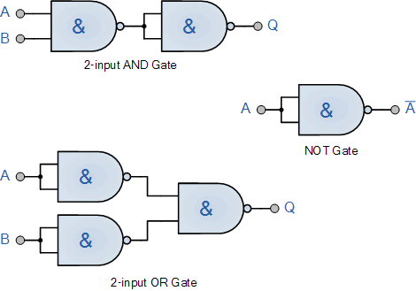
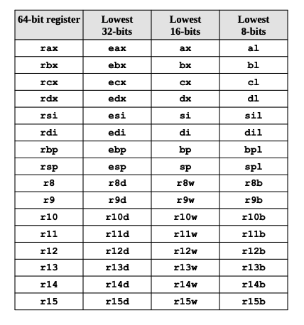

# Assembly NASM


## Sumário

A intenção deste projeto é reunir todo o conhecimento que eu adquiri sobre a linguagem  Assembly NASM em um único documento, para que eu possa revisar e relembrar o que aprendi e ao mesmo tempo ajudar outras pessoas que também tem interesse em aprender Assembly.

Eu mesmo já tentei começar algumas vezes e sempre me desaniva no inicio por não saber por onde começar, achar o conteúdo extremamente difícil por não saber algumas bases importantes e não ter um material que me guiasse de maneira mais simples e objetiva.

Como é um assunto extremamente complexo, extenso, que requer conhecimento de vários assuntos diferentes e pouquissimo divulgado, acaba sendo muito difícil encontrar conteúdo de qualidade sobre o assunto de maneira mais completa e objetiva.

Então eu decidi reunir todas as coisas que eu julguei importante durante meu processo de aprendizado/pesquisa sobre o assunto para que mais desenvolderes(curiosos assim como eu) possam enfrentar os primeiros passos de maneira mais fácil e rápida.

Se você, assim como eu, gosta de saber como as coisas são feitas "por baixo dos panos" eu garanto que
será uma viagem muito interessante e divertida. Capaz de melhorar seu entendimento em programação e computação como um todo. Não sou desenvolvedor Assembly e muito menos pretendo começar a trabalhar nesta área, mas acredito que o conhecimento que adquiri durante este processo me ajudou a ser um desenvolvedor melhor.

### Dicas

Deixo aqui algumas dicas para quem está começando:

0. Este não é um guia "Do Zero ao GOD em Assembly", portanto se você ainda é muito iniciante e/ou viu pouquissimas coisas teóricas sobre computação, acredito que não seja pra você... volte mais tarde quando já tiver mais conhecimento e a "sede de saber como as coisas funcionam por baixo dos panos" estiver te consumindo.

1. Como em todo tipo de aprendizado, ser constante é extremamente fundamental, não adianta estudar 8 horas em um dia e não estudar mais nada durante a semana. É muito melhor estudar 1 hora por dia durante a semana pois mantém seu cérebro ativo e familirizado com o assunto.

2. É um assunto relativamente difícil. Então não desanime se você não entender tudo de primeira, é normal, continue estudando e revisando o conteúdo que aos poucos as coisas começam a fazer mais sentido.

3. Você NÃO vai decorar tudo.

4. Se você não pretende ser um Dev Assembly, não se preocupe se algumas coisas você não conseguir fazer
sozinho na prática, acredito ser mais importante entender o conceito e saber que aquilo existe e existe por alguma razão.

5. Faça anotações e tente realizar os exercícios propostos, isso vai te ajudar a fixar o conteúdo e a entender melhor o que está acontecendo.

6. Visite os Links listados abaixo apenas quando o assunto surgir e depois volte no ponto em que parou, não é muito produtivo para sua mente assimilar várias coisas totalmente diferentes ao mesmo tempo, portanto estudar
desta forma vai manter seu cérebro "no tranco".

7. Seja leve com você mesmo e divirta-se com cada coisinha legal que você aprender ou assimilar com algo que você faz no dia-a-dia na sua linguagem de programação favorita.

## Links úteis

Aqui eu listarei todos os artigos/documentações/livros e quaisquer fontes de estudo que eu utilizei para aprender assembly e escrever este documento.

- Link da documentação do NASM: <https://www.nasm.us/xdoc/2.16.01/html/nasmdoc0.html>

- Link do livro "Programação em baixo nível": <https://www.amazon.com.br/gp/product/8575226673/ref=ppx_yo_dt_b_asin_title_o07_s01?ie=UTF8&psc=1>

- Hierarquia de memória do computador: <https://annamalaiuniversity.ac.in/studport/download/engg/it/resources/Unit-IV%20&%20V%20Course%20Material.pdf>

- Como funciona a alocação de memória, quais tipos de declaração de variáveis existem e como utiliza-las em assembly: <https://www.cs.uaf.edu/2015/fall/cs301/lecture/09_23_allocation.html>

- Endianess, como seu processador lê os bytes?: <https://www.freecodecamp.org/news/what-is-endianness-big-endian-vs-little-endian/>

## Referências importantes

Aqui eu listarei links para assuntos que também são importantes para compreender a história da computação e evolução dos processadores mas que não são o foco deste documento para não ficar ainda mais massante e complexo do que já será.

- NAND: <https://pt.wikipedia.org/wiki/Porta_NAND>

- Universal Turing Machine: <https://web.mit.edu/manoli/turing/www/turing.html>

- Arquitetura de Von Neumann: <https://pt.wikipedia.org/wiki/Arquitetura_de_von_Neumann>

## Vídeos e Cursos com assuntos relacionados que eu recomendo

- Nand 2 Tetris: <https://www.coursera.org/learn/build-a-computer>
  - Este curso é muito interessante pois ele te ensina a construir um computador do zero, desde o hardware até o software, passando por todos os níveis de abstração.

- Canal do Fábio Akita: <https://www.youtube.com/@Akitando>
  - Aqui você encontrará vídeos sobre os mais diversos tópicos sobre computação(Como os que falaremos neste projeto) de maneira bem explicada e em português.

Sinta-se livre pra mandar algum PR ou sugerir alguma alteração/pontuar erros na explicação ☺️

## Como funciona um processador?

Tudo começa com a porta lógica **NAND**. Porque ela é tão importante? Basicamente podemos construir qualquer tipo de circuito lógico, portanto é totalmente possível construir um processador funcional com centenas de milhares de portas NAND's e nada mais. Claro que podem existir(e provavelmente não é feito só disso obviamente) alguns processos mais específicos para que seja mais otimizado para determinada situação, mas é muito louco pensar que isso é possível, é realmente incrível.


Ta, mas porque eu citei isso?

O processador possuí vários tipos de portas lógicas para realizar as operações como por exemplo as portas `AND`, `OR`, `XOR`, `NOT`, etc... e outras mais elaboradas como `ADDER`, `HALF-ADDER`, `FULL-ADDER`, `MUX`, `DEMUX`, e muitas outras. Todas podem ser construídas utilizando apenas portas NAND's e no assembly nós temos controle total de como as coisas são feitas, portanto podemos utilizar qualquer uma dessas portas lógicas para realizar as operações que quisermos.

### Exemplo de portas lógicas construídas com portas NAND's (AND, OR, NOT)


Ao infinito e além...

---

Nem todas precisam existir fisicamente no processador pois podem ser criadas através do software como a multiplicação(shift-left) e divisão(shift-right) por exemplo. O importante é que você verá comandos com o nome de algumas dessas portas o tempo todo e é importante saber o que elas fazem para que você não fique perdido nos comandos e em como os bytes são manipulados.

Muitos destes comandos você pode encontrar em linguagens mais alto nível e você ja deve ter se familiarizado aqui como `AND(&)`, `OR(|)`, `XOR(^)`, `NOT(!)`, `SHIFT(<< >>)` e sim, vão funcionar praticamente igual (Mas com sintaxe, mnemônicos, nomes diferentes) e alguns comportamentos estranhos vão te deixar coçando a cabeça por que o resultado da manipulação dos bytes não saiu como supostamente você imaginava que seria. Leia sobre [Endianess](#links-úteis). Mas existem muitos outros e que controlaremos cada ação que acontece no processador de maneira muito mais direta e detalhada do que em linguagens de alto nível onde a linguagem já abstraiu praticamente tudo pra você.

Caso queira criar seu próprio processador(um modelo bem simplista) para entender melhor seu funcionamento, recomendo assistir o curso [Nand 2 Tetris](#vídeos-e-cursos-com-assuntos-relacionados-que-eu-recomendo) na seção de Links.

## Registradores

Agora que você já conhece o basico sobre as portas lógicas, é hora de falar sobre registradores pois você os utilizará em conjunto com as portas lógicas para realizar as operações.

Registradores são elementos de armazenamento(Memória `LVL 0`) de alta velocidade(*A memória mais rápida do seu computador*) localizados na Unidade de Processamento Central (CPU/Processador). Eles são usados para armazenar dados temporários e informações que estão sendo processadas ativamente pela CPU. Os registradores são componentes fundamentais da arquitetura de um computador e desempenham um papel crucial no funcionamento do processamento de dados. Aqui estão algumas características e funções dos registradores:

1. **Armazenamento de Dados Temporários:** Os registradores são usados para armazenar dados temporariamente enquanto a CPU executa operações neles. Isso permite que a CPU realize cálculos e manipulações em dados rapidamente, sem a necessidade de acessar a memória principal.

2. **Operações Aritméticas e Lógicas:** Os registradores são usados ​​para armazenar operandos e resultados de operações aritméticas, lógicas e de manipulação de dados. Por exemplo, durante uma operação de adição, os valores a serem somados são temporariamente armazenados em registradores.

3. **Registro de Endereço e Controle:** Alguns registradores são usados para armazenar endereços de memória ou apontadores para localizar dados na memória principal. Eles também podem ser usados para armazenar informações de controle, como o estado atual da CPU.

4. **Acesso Rápido:** Os registradores estão localizados diretamente na CPU e oferecem acesso muito mais rápido do que a memória principal. Isso é fundamental para o desempenho do processamento de dados, uma vez que as operações podem ser realizadas mais rapidamente quando os dados estão disponíveis nos registradores.

5. **Quantidade Limitada:** A quantidade de registradores em uma CPU é limitada. O número e a capacidade de registradores variam entre diferentes arquiteturas de CPU. Geralmente, há um conjunto de registradores de propósito geral que podem ser usados para várias finalidades.

6. **Registradores Especiais:** Além dos registradores de propósito geral, algumas CPUs também possuem registradores especiais dedicados a funções específicas, como registradores de estado (para armazenar informações sobre o estado da CPU), registradores de ponto flutuante (para operações de números em ponto flutuante) e outros.

Os registradores desempenham um papel vital na execução de programas e operações de computador, permitindo que a CPU processe dados de maneira eficiente e rápida. Eles são uma parte essencial da arquitetura do computador e contribuem para o desempenho e a capacidade de processamento de dados do sistema.

Abaixo você pode ver os registradores da arquitetura x86-64:



Falaremos mais sobre cada registrador ao decorrer deste documento:

- Qual o propósito de cada registrador
- Como cada registrador é usado

### Registrador RFLAGS

O registrador `RFLAGS` é um registrador especial de 64 bits em processadores x86 que contém várias flags que indicam o estado atual do processador. As flags mais comuns são:

- `CF` (Carry Flag): Indica se houve um overflow ou underflow em uma operação aritmética ou lógica. Por exemplo, se uma adição resultar em um valor maior do que o tamanho do registrador, o bit `CF` será definido para 1.

- `AF` (Auxiliary Carry Flag): Indica se houve um carry ou borrow na parte inferior de um byte em uma operação aritmética ou lógica. Essa flag é usada principalmente em operações com números BCD (Binary Coded Decimal).

- `ZF` (Zero Flag): Indica se o resultado de uma operação aritmética ou lógica é zero. Se o resultado for zero, o bit ZF será definido para 1.

- `OF` (Overflow Flag): Indica se houve um overflow ou underflow com sinal em uma operação aritmética ou lógica. Por exemplo, se uma subtração resultar em um valor menor do que o menor valor representável pelo tipo de dados, o bit `OF` será definido para 1.

- `SF` (Sign Flag): Indica se o resultado de uma operação aritmética ou lógica é negativo. Se o resultado for negativo, o bit SF será definido para 1.

A diferença entre `OF` e `CF` é que `OF` indica um overflow ou underflow com sinal, enquanto `CF` indica um carry ou borrow sem sinal. Em outras palavras, `OF` é usado para operações com números com sinal, enquanto `CF` é usado para operações com números sem sinal. Por exemplo, se você adicionar dois números com sinal e o resultado for maior do que o maior valor representável pelo tipo de dados, o bit `OF` será definido para 1. Se você adicionar dois números sem sinal e o resultado for maior do que o maior valor representável pelo tipo de dados, o bit `CF` será definido para 1.

### Registradores controlados pelo sistema operacional

Os registradores `CR0` até `CR8` são registradores de controle em processadores x86 que controlam vários aspectos do funcionamento do processador e do sistema operacional. Cada registrador tem um propósito específico:

- **CR0 (Control Register 0)**: Controla o modo de operação do processador, incluindo o modo protegido, o modo real e o modo virtual. Também controla a habilitação de caches, a proteção de memória e outras características do processador.
- **CR1 (Control Register 1)**: Não é usado em processadores modernos.
- **CR2 (Control Register 2)**: Contém o endereço da última página de memória que causou uma exceção de página. É usado para implementar a paginação de memória em sistemas operacionais.
- **CR3 (Control Register 3)**: Contém o endereço da tabela de páginas do sistema operacional. É usado para implementar a paginação de memória em sistemas operacionais.
- **CR4 (Control Register 4)**: Controla várias características do processador, incluindo a habilitação de extensões de arquitetura, a habilitação de caches, a proteção de memória e outras características.
- **CR5 até CR7**: Não são usados em processadores modernos.
- **CR8 (Control Register 8)**: Controla a prioridade de interrupções em sistemas operacionais que usam o modelo de interrupções assíncronas.

Em geral, os registradores CR0 até CR4 são os mais importantes e são usados em sistemas operacionais para controlar a proteção de memória, a paginação de memória e outras características do processador. Os registradores CR2 e CR3 são usados especificamente para implementar a paginação de memória em sistemas operacionais. O registrador CR8 é usado em sistemas operacionais que usam o modelo de interrupções assíncronas para controlar a prioridade de interrupções.

## Pilha de hardware

A pilha de hardware(*STACK*) é uma pilha de dados localizada na memória principal que é usada para armazenar dados temporários e endereços de retorno durante a execução de sub-rotinas. A pilha de hardware é usada principalmente para armazenar endereços de retorno, mas também pode ser usada para armazenar outros dados temporários. A pilha de hardware é usada em conjunto com o registrador `RSP` para armazenar e recuperar dados da pilha.

`RSP` é um registrador de 64 bits que contém o endereço topo da pilha de hardware e `RBP` o endereço base. os comandos `PUSH` e `POP` inserem os elementos no topo da pilha (Em `RSP`) e são amplamente utilizados portanto preste muita atenção quando eu demonstrar os exemplos de uso poiseles são fundamentais em qualquer código Assembly. A forma como funciona é exatamente como uma estrutura de dados do tipo pilha, isto é, LIFO.


## Interrupções

Interrupções são eventos imprevisíveis que interrompem a execução normal de um programa ou tarefa. Essas interrupções são usadas para lidar com eventos externos, como dispositivos de hardware, solicitações de entrada/saída, erros de hardware, temporizadores e outras situações que requerem atenção imediata do sistema. As interrupções desempenham um papel fundamental em sistemas operacionais e na interação entre hardware e software. Aqui estão os principais pontos relacionados a interrupções:

1. **Origem das Interrupções:** As interrupções podem ser geradas por várias fontes, como dispositivos de hardware (por exemplo, teclado, mouse, disco rígido, placa de rede), temporizadores, solicitações de E/S (entrada/saída), erros de hardware, eventos de software e assim por diante.

2. **Prioridade:** As interrupções podem ter níveis de prioridade, de modo que algumas são tratadas antes de outras. Isso permite que o sistema lide primeiro com as interrupções mais críticas ou urgentes.

3. **Manuseio de Interrupções:** Quando uma interrupção ocorre, o processador suspende temporariamente a execução do programa atual e transfere o controle para um tratador de interrupção (interrupt handler) específico, que é um trecho de código responsável por lidar com a interrupção. O tratador de interrupção executa as ações necessárias para atender à interrupção.

4. **Contexto de Execução:** O tratador de interrupção deve salvar o contexto da tarefa atual, incluindo registradores, contadores de programa e outros estados relevantes, antes de começar a lidar com a interrupção. Isso permite que a tarefa original seja retomada após o tratamento da interrupção.

5. **Retorno da Interrupção:** Após o tratamento da interrupção, o processador retorna ao estado anterior, recuperando o contexto da tarefa original e continuando a execução do programa a partir do ponto em que foi interrompido.

6. **Máscara de Interrupções:** Em muitos sistemas, é possível habilitar ou desabilitar interrupções, o que é útil em situações em que você deseja evitar interrupções durante uma operação crítica.

7. **Temporizadores e Relógio de Sistema:** Os temporizadores são frequentemente usados para gerar interrupções em intervalos regulares, o que é útil para manter um relógio de sistema preciso e para agendar tarefas em sistemas operacionais.

8. **Controladores de Interrupção:** Os controladores de interrupção são dispositivos de hardware que auxiliam na gestão e distribuição de interrupções. Eles ajudam a identificar a origem da interrupção e determinar qual tratador de interrupção deve ser chamado.

Em resumo, as interrupções são mecanismos críticos para permitir que um sistema de computador lide eficazmente com eventos externos e seja capaz de executar tarefas em segundo plano, como gerenciar dispositivos de hardware, monitorar eventos de tempo e fornecer serviços multitarefa. Eles desempenham um papel fundamental na estabilidade e na capacidade de resposta de sistemas computacionais.

## Assembly

### Prepando o ambiente

#### MacOS

- Instalando Homebrew

    ```bash
    /bin/bash -c "$(curl -fsSL https://raw.githubusercontent.com/Homebrew/install/HEAD/install.sh)"
    ```

- Instalando NASM

    ```zsh
        brew install nasm
    ```

- Adicionando suporte ao NASM no VSCode

    Procure a extensão **NASM Language Support**

- Para rodar os exemplos deste projeto basta rodar o comando abaixo

    ```zsh
        make run TARGET={{nome_do_arquivo}}
    ```

### Sintaxe

Estrutura basica de um código assembly NASM para arquitetura Intel x86_64(Existem outras sintaxes de assembly):

```assembly
global start

section .text                       ; Todo código fonte deve estar dentro da seção .text, incluindo declaração de funções(rótulos e instruções)
start:
    ; codigo aqui

section .data
    ; dados ja inicializados aqui

section .bss
    ; dados nao inicializados aqui
```

### Instruções

As instruções são os comandos que o processador executa. Cada instrução é representada por um **mnemônico**, código de operação (opcode) que indica o tipo de instrução e os operandos que a acompanham. Os operandos podem ser registradores, valores imediatos, endereços de memória ou rótulos. Aqui estão alguns exemplos de instruções:

```assembly
    mov eax, 0x1234             ; move o valor 0x1234 para o registrador eax
    add eax, ebx                ; adiciona o valor do registrador ebx ao registrador eax
    jmp 0x1234                  ; salta para o endereço 0x1234
```

No exemplo anterior, `mov`, `add` e `jmp` são mnemônicos que representam um comando no processador. `eax`, `ebx` são registradores e `0x1234` é um valor imediato. Os registradores são usados ​​para armazenar dados temporários e os valores imediatos são valores constantes que são usados ​​como operandos. Os registradores e valores imediatos são exemplos de operandos.

### Syscalls

Syscalls são chamadas de sistemas para que seja possível interagir com o sistema operacional, como existem
niveis de privilégio, nenhum programa pode acessar diretamente os recursos do sistema operacional, então
é necessário fazer uma chamada de sistema para que o sistema operacional execute a ação desejada.

Para fazer uma syscall é necessário colocar o numero da syscall no registrador rax e os argumentos das syscalls nos demais registradores `rdi`, `rsi`, `rdx`, `r10`, `r8` e `r9`.

```assembly
    mov rax, 1                  ; numero da syscall

    ; registradores de argumentos disponíveis para syscalls, todas syscalls tem limite de 6 argumentos, os registradores são:

    ; rdi, rsi, rdx, r10, r8, r9

    mov rdi, 1                  ; primeiro argumento
    mov rsi, 0x1234             ; segundo argumento
    mov rdx, 0x5678             ; terceiro argumento
    mov r10, 0x9abc             ; quarto argumento
    mov r8, 0xdef0              ; quinto argumento
    mov r9, 0x1234              ; sexto argumento

    syscall ; executa a syscall
```

#### Dica

```assembly
    push rax                ; salva o valor de rax na pilha (poderia ser qualquer outro registrador)
    pop rax                 ; recupera o valor mais ao topo da pilha e mov para o registrador rax

    ; Portanto a pilha também pode ser usada para salvar valores de registradores
```

### Funções

Funções são trechos de código que podem ser chamados de qualquer lugar do programa, exatamente como você já faz em linguagens alto nível. Elas são muito úteis para encapsular
algoritmos e reutiliza-los em vários lugares do programa, para criar uma função basta dar um rótulo e colocar as instruções
logo abaixo.

```assembly
funcao:
    ; codigo aqui
```

Para chamar uma função basta usar a instrução call

```assembly
    call funcao
```

A instrução call é equivalente a:

```assembly
    push rip            ; salva o endereço de retorno na pilha
    jmp funcao          ; salta para a função
```

Para retornar de uma função basta usar a instrução ret

```assembly
    mov rax, 0x2000004  ; numero da syscall write
                        ; restante do algoritmo
    ret                 ; final da função
```

A instrução ret é equivalente a:

```assembly
    pop rip             ; recupera o endereço de retorno da pilha
    jmp rip             ; salta para o endereço de retorno
```

Ao utilizar funções precisamos estar atentos a uma convenção de chamada de funções:

- Callee saved:
  - registradores envolvidos: `rbx`, `rbp`, `rsp`, `r12`, `r13`, `r14`, `r15`

- Caller saved:
  - registradores envolvidos: *todos os outros*

Os registradores "callee-saved" (salvos pelo chamado) e "caller-saved" (salvos pelo chamador) são conceitos relacionados às convenções de chamada de funções em assembly e linguagens de programação de baixo nível. Eles se referem a como os registradores são tratados ao chamar uma função (chamadora) e dentro de uma função (chamada). Aqui está uma explicação e exemplos simples de ambos os métodos:

1. Registradores "Callee-Saved" (Salvos pelo Chamado):
   Os registradores "callee-saved" são registradores que uma função chamada (sub-rotina) deve salvar e restaurar se desejar usá-los. Isso significa que, se uma função chamada desejar usar um registrador específico, ela deve garantir que o valor original do registrador seja salvo no início da função e restaurado no final da função. Os registradores "callee-saved" são geralmente usados para preservar os valores das variáveis locais da função chamadora.

   Exemplo de código (assembly x86):

    ```assembly
   section .text

   global main

   main:
       push ebp        ; Salva o valor antigo do registrador base da pilha
       mov ebp, esp    ; Atualiza o registrador base da pilha

       ; Qualquer código que use os registradores "callee-saved" aqui
       ; ...

       pop ebp         ; Restaura o valor original do registrador base da pilha
       ret
   ```

   No exemplo acima, o registrador `EBP` é um registrador "callee-saved". A função principal (`main`) salva o valor original de `EBP` no início e restaura-o no final, garantindo que não altere o valor que a função chamadora pode estar usando.

2. Registradores "Caller-Saved" (Salvos pelo Chamador):
   Os registradores "caller-saved" são registradores que a função chamadora (que chama a função) deve salvar e restaurar se desejar preservar seus valores durante uma chamada de função. Isso significa que, se a função chamadora desejar manter o valor de um registrador "caller-saved", ela deve salvar e restaurar esse valor antes e depois de chamar a função.

   Exemplo de código (assembly x86):

   ```assembly
   section .text

   global caller_function
   global callee_function

   caller_function:
       mov eax, 42     ; Define um valor em eax

       push eax        ; Salva o valor de eax na pilha
       call callee_function
       pop eax         ; Restaura o valor de eax da pilha

       ; Agora podemos usar eax sem se preocupar com a função chamada
       ; ...

       ret

   callee_function:
       push ebp        ; Salva o valor antigo do registrador base da pilha
       mov ebp, esp    ; Atualiza o registrador base da pilha

       ; Usamos eax e devemos restaurá-lo antes de retornar
       ; ...

       pop ebp         ; Restaura o valor original do registrador base da pilha
       ret
   ```

Neste exemplo, o registrador `EAX` é um registrador "caller-saved". A função chamadora (`caller_function`) salva seu valor antes de chamar a função chamada (`callee_function`) e o restaura após a chamada, para garantir que o valor original de `EAX` seja mantido.

Portanto:

- Salve todos os registradores caller-saved que voce queira que sobrevivam a uma chamada de função (use `push` para isso)
- Armazene os argumentos da função nos registradores relevantes: `rdi, rsi, etc...`
- Chame a função utilizando `call`
- Depois que a função retornar, `rax` conterá o valor de retorno, caso precise retornar 2 valores você pode utilizar o `rdx`
- Restaure os registradores caller-saved que voce salvou anteriormente (use `pop` para isso)

Importante: `RSP` e `RBP` são reservados para a STACK (pilha), portanto não devem ser utilizados para armazenar valores pois esta pratica pode causar problemas. Imagine que a cada função chamada o código está adicionando na pilha o endereço das instruções que devem ser executadas após o retorno da função, se você sobrescrever o valor de `RSP` ou `RBP` você pode acabar sobrescrevendo o endereço de retorno da função e isso pode causar um comportamento inesperado.

#### Em progresso 👷🏻
